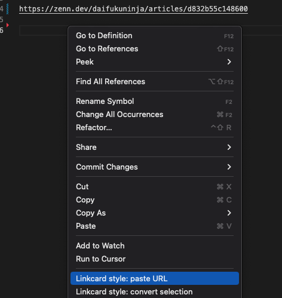
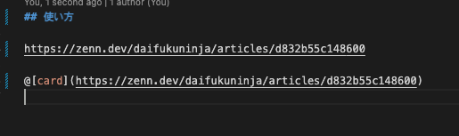

# URL to Linkcard for Zenn markdown

This extension decorates URL strings to [Zenn](https://zenn.dev/) link card notation.

[日本語はこちら。](./README.md)

## Features

- Decorate the URL format string with Zenn's link card notation (`@[card](...)`).
- It can be executed from the context menu on any markdown file.
- Convert and paste the URL string copied to the clipboard.
- Replaces the URL string selected on the editor with link card notation.

## Notices

- Only available for markdown format (*.md) files.
- It relies on the [`is-url` module](https://www.npmjs.com/package/is-url) to determine if a string is in URL format.

## For example

Copy any URL string.

Once copied, select `Linkcard style: paste URL` from the context menu on the editor.

Paste the copied URL in link card format at the cursor position.

## Known issues

- Batch conversion of multiple rows

## License

Apache License 2.0
