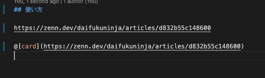

# URL to Linkcard for Zenn markdown

この拡張機能は、URL文字列を[Zenn](https://zenn.dev/)のリンクカード記法に装飾します。

[English here.](./README.en.md)

## 特徴

- URL形式の文字列を、Zennのリンクカード記法( **@\[card\]\("{url}"\)** )に装飾します。
- 任意のmarkdownファイル上で、コンテキストメニューから実行できます。
- クリップボードにコピーしたURL文字列を変換して貼り付けます。
- エディタ上で選択したURL文字列をリンクカード記法に置換します。

## 使用上のご注意

- markdown形式(*.md)ファイルでのみ利用できます。
- 文字列がURL形式かどうかを判定するため、[`is-url`モジュール](https://www.npmjs.com/package/is-url)に依存しています。

## 使い方の例

任意のURL文字列をコピーします。

コピーしたら、エディタ上でコンテキストメニューから`Linkcard style: paste URL`を選択します。

カーソル位置に、コピーしたURLをリンクカード形式で貼り付けます。

## 今後の拡張予定

- 複数行の一括変換

## ライセンス

Apache License 2.0
